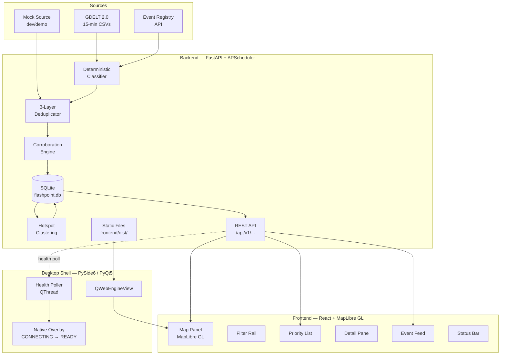
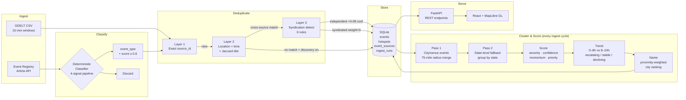

<div align="center">


# Flashpoint

**Local-first U.S. civil unrest monitoring workstation**

[](https://python.org)
[](https://fastapi.tiangolo.com)
[](https://react.dev)
[](https://maplibre.org)
[](https://sqlite.org)
[](https://raspberrypi.com)
[](backend/tests/)

</div>

---

Flashpoint is a single-operator intelligence dashboard that aggregates, classifies, deduplicates, and visualizes U.S. protest and civil disruption events in near real time. It runs as a fullscreen native desktop application — designed to live permanently on a **Raspberry Pi 5 with a 7-inch touchscreen**, feeling like a real piece of installed equipment rather than a website.

The pipeline pulls from public OSINT sources (GDELT 2.0, Event Registry), runs each article through a **deterministic NLP classifier**, deduplicates across sources with a **6-rule syndication detector**, builds **multi-source corroborated confidence scores**, clusters events into geographic hotspots with **greedy radius clustering and proximity-weighted naming**, and serves everything through a **FastAPI backend + React/MapLibre GL dashboard**, embedded in a PySide6/PyQt5 Qt shell with zero browser chrome.

<!-- SCREENSHOT: Add a screenshot of the running dashboard here.
     Suggested: `docs/screenshot.png` — capture the map with hotspot markers,
     the priority list, and the status bar. Then uncomment the line below.
-->
<!--  -->

---

## Features

- **Multi-source ingestion** — GDELT 2.0 (free, 15-min cadence) and Event Registry (API key, supplementary). Mock source for dev and demo.
- **Deterministic classifier** — four-signal NLP pipeline (title keywords, body keywords, DMOZ categories, Wikipedia concepts). No LLM, no external calls. Classifies into 8 event types: `protest`, `riot`, `political_violence`, `police_clash`, `vandalism_tied_to_unrest`, `crowd_disruption`, `protest_related_road_shutdown`, `unrest`.
- **Three-layer deduplication** — exact `source_id` match → cross-source similarity (haversine + time window + Jaccard title) → syndicated copy detection (6 rules: same outlet, wire family, title similarity, wire domain URL, timestamp proximity, ER event URI grouping).
- **Corroboration model** — each independent source adds +0.08 confidence. Syndicated wire republications (AP, Reuters, UPI, AFP, CNN, NBC) add zero. Uncorroborated ER-only events are confidence-capped by location precision tier (venue: 0.62, city: 0.58, state: 0.45).
- **Geographic hotspot clustering** — two-pass greedy radius algorithm (75-mile metro radius, 72-hour event window). City/venue events anchor and merge in pass 1; state-level signals fall back to pass 2 state grouping. Pruned to minimum 3 events, capped at 15 hotspots.
- **Proximity-weighted hotspot naming** — ranks candidate city names by `count / (1 + mean_distance / 50mi)` so the closest, most-frequent city wins. Falls back to county → state region → coordinates.
- **Trend analysis** — compares 0–8h vs 8–24h event windows per cluster. Escalating / stable / declining with severity delta gating.
- **Dark-theme map dashboard** — MapLibre GL with CARTO Dark Matter basemap. Severity-colored event circles, trend-colored hotspot glow rings, toggleable heatmap layer, fly-to animation on selection.
- **60-second polling with selection reconciliation** — hotspots, priorities, and system status refresh automatically. If the selected hotspot is recomputed away (ID reuse), the selection is transparently cleared.
- **Real-time operator status** — status bar shows data freshness, staleness detection, run-failed alerts, and live syncing indicators.
- **Touch-ready Pi appliance** — systemd user service + XDG autostart + fullscreen Qt shell with native connecting/unavailable overlay states. No browser chrome, no accounts, no cloud.
- **106 backend tests** — classifier, deduplication, corroboration, confidence model, clustering, hotspot naming.

---

## Architecture



### Deployment topology (Raspberry Pi)

```
Pi boots → auto-login (pi user)
  │
  ├── systemd --user → flashpoint-backend.service
  │     └── uvicorn app.main:app  (127.0.0.1:8000)
  │           └── serves frontend/dist/ as static files
  │
  └── XDG autostart → pi_start.sh → python -m desktop.app.main
        └── PySide6 / PyQt5 fullscreen window
              ├── QWebEngineView  →  http://127.0.0.1:8000
              └── HealthPoller (QThread, polls /api/v1/health)
                    CONNECTING → LOADING_WEBVIEW → READY
```

---

## Tech Stack

| Layer | Technology | Notes |
|---|---|---|
| **Backend** | Python 3.11+, FastAPI 0.111+ | ASGI via uvicorn |
| **ORM / DB** | SQLAlchemy 2.0, SQLite | 4 tables: events, hotspots, event_sources, ingest_runs |
| **Scheduling** | APScheduler 3.10 | Background ingest cycles (30-min default) |
| **HTTP client** | httpx 0.27 | GDELT CSV fetches, Event Registry API calls |
| **Config** | pydantic-settings 2.0 | `.env`-backed, typed settings |
| **Frontend** | React 19, Vite 8 | No external state library |
| **Map** | MapLibre GL 5.21 | CARTO Dark Matter basemap |
| **Desktop (Mac)** | PySide6 6.6+ | pip-installed |
| **Desktop (Pi)** | PyQt5 (system packages) | `python3-pyqt5.qtwebengine` via apt |
| **Qt compat layer** | `desktop/app/qt_compat.py` | Tries PySide6, falls back to PyQt5 |
| **Pi OS** | Raspberry Pi OS 64-bit Bookworm | systemd user service + XDG autostart |
| **Testing** | pytest | 106 tests, zero external calls |

---

## Quick Start

**Prerequisites:** Python 3.11+, Node.js 18+

```bash
# 1. Clone and set up the Python environment
git clone https://github.com/pattyhomes/Flashpoint.git
cd Flashpoint
python3 -m venv .venv
source .venv/bin/activate
pip install -e .

# 2. Install frontend dependencies
cd frontend && npm install && cd ..

# 3. Configure environment
cp .env.example .env
# Edit .env if needed — defaults use mock data, no API keys required

# 4. Install desktop shell (Mac)
pip install -r desktop/requirements.txt

# 5. Seed mock data and launch everything
bash scripts/seed_mock_data.sh
bash scripts/run.sh
```

`scripts/run.sh` starts the backend (port 8001), frontend dev server (port 5178), and the PySide6 desktop shell in a single command. Press `Command+Q` (macOS) to quit.

### Individual services

```bash
# Backend only (port 8000, with hot reload)
bash scripts/dev_backend.sh
# → API docs:    http://localhost:8000/docs
# → Health:      http://localhost:8000/api/v1/health

# Frontend only (Vite dev server, port 5173)
cd frontend && npm run dev
# → Proxies /api → http://127.0.0.1:8000

# Desktop shell only (requires backend + frontend already running)
bash scripts/dev_desktop.sh
```

---

<details>
<summary><strong>Project Structure</strong></summary>

```
Flashpoint/
├── backend/
│   ├── app/
│   │   ├── main.py                  # FastAPI app, lifespan, CORS, static files
│   │   ├── config.py                # pydantic-settings (all env vars)
│   │   ├── models.py                # Event, Hotspot, EventSource, IngestRun
│   │   ├── schemas.py               # Pydantic request/response models
│   │   ├── routes/                  # health, events, hotspots, priorities, system
│   │   ├── services/
│   │   │   ├── ingestion/
│   │   │   │   ├── gdelt_source.py          # GDELT 2.0 CSV ingestion
│   │   │   │   ├── eventregistry_source.py  # Event Registry API
│   │   │   │   ├── mock_source.py           # Dev/demo data
│   │   │   │   ├── classifier.py            # Deterministic NLP classifier
│   │   │   │   ├── deduper.py               # 3-layer deduplication
│   │   │   │   └── normalizer.py
│   │   │   └── scoring/
│   │   │       └── hotspot.py               # Clustering, scoring, trend, naming
│   │   └── jobs/
│   │       ├── scheduler.py         # APScheduler job registration
│   │       └── seed.py              # Ingestion runners + mock seeding
│   └── tests/
│       ├── test_classifier.py
│       ├── test_deduper_enhanced.py
│       ├── test_eventregistry_confidence.py
│       ├── test_eventregistry_ingestion.py
│       ├── test_hotspot_clustering.py
│       └── test_hotspot_naming.py
│
├── frontend/
│   └── src/
│       ├── App.jsx                  # Root — all state, polling, filtering
│       ├── components/
│       │   ├── layout/              # Shell (CSS grid), StatusBar
│       │   ├── map/                 # MapPanel (MapLibre GL)
│       │   ├── filters/             # FilterRail
│       │   ├── priorities/          # PriorityList
│       │   ├── detail/              # DetailPane
│       │   └── feed/                # EventFeed
│       ├── services/api.js          # Fetch wrapper for /api/v1/*
│       └── styles/                  # CSS custom properties, dark theme
│
├── desktop/
│   └── app/
│       ├── qt_compat.py             # PySide6/PyQt5 compatibility layer
│       ├── config.py                # Runtime constants (ports, timeouts, Pi flags)
│       ├── launcher.py              # Subprocess orchestrator (dev path)
│       ├── main.py                  # Entry point: python -m desktop.app.main
│       └── window.py                # MainWindow, HealthPoller, OverlayWidget
│
├── deploy/pi/
│   ├── install.sh                   # Installs systemd service + XDG autostart
│   ├── flashpoint-backend.service   # systemd user service template
│   └── flashpoint.desktop           # XDG autostart entry template
│
├── scripts/
│   ├── run.sh                       # All-in-one dev launcher (preferred)
│   ├── dev_backend.sh
│   ├── dev_desktop.sh
│   ├── seed_mock_data.sh
│   └── pi_start.sh                  # Pi shell launcher
│
└── data/
    └── flashpoint.db                # SQLite (gitignored)
```

</details>

---

## Data Pipeline



**Key design decisions:**
- GDELT events start at confidence 0.50 (single source); each additional GDELT article referencing the same event adds +0.10
- ER events start conservative (0.30–0.62) and are capped until independently corroborated
- Wire service families (AP, Reuters, UPI, AFP, CNN, NBC) are tracked so syndicated republications don't inflate source counts
- State-level location signals are allowed to contribute to clusters but don't shift city-level centroids

---

## API Reference

| Method | Path | Description |
|---|---|---|
| `GET` | `/api/v1/health` | Service health + DB connectivity |
| `GET` | `/api/v1/events/` | Paginated event list (default limit 500, max 1000) |
| `GET` | `/api/v1/events/{id}` | Event detail with full source provenance |
| `GET` | `/api/v1/hotspots/` | All hotspots ordered by priority score |
| `GET` | `/api/v1/hotspots/{id}` | Hotspot detail with member events |
| `GET` | `/api/v1/priorities/` | Top 3 hotspots (quick dashboard summary) |
| `GET` | `/api/v1/system/status` | Freshness, staleness, run status, counts |

Interactive API docs available at `http://localhost:8000/docs` when the backend is running.

---

<details>
<summary><strong>Configuration (.env reference)</strong></summary>

```bash
APP_ENV=development
APP_HOST=127.0.0.1
APP_PORT=8000

DATABASE_URL=sqlite:///../data/flashpoint.db

# Primary ingestion source: "mock" (dev) or "gdelt" (production)
INGEST_SOURCE=mock
MOCK_DATA_ENABLED=true
INGESTION_INTERVAL_SECONDS=1800    # 30 minutes

# Event Registry — supplementary source (runs alongside GDELT/mock)
# EVENT_REGISTRY_ENABLED=false
# EVENT_REGISTRY_API_KEY=                          # required when enabled
# EVENT_REGISTRY_INTERVAL_SECONDS=1800
# EVENT_REGISTRY_LOOKBACK_HOURS=6
# EVENT_REGISTRY_MAX_RECORDS=100
# EVENT_REGISTRY_MIN_CLASSIFICATION_SCORE=0.6
# EVENT_REGISTRY_MIN_LOCATION_PRECISION=city       # venue | city | state
# EVENT_REGISTRY_CREATE_NEW_EVENTS=false           # enable novel event discovery
# EVENT_REGISTRY_MAX_NEW_EVENTS_PER_RUN=10
# EVENT_REGISTRY_MAX_CONFIDENCE_UNCORROBORATED=0.58

# Desktop shell (Pi deployment overrides)
# FLASHPOINT_FULLSCREEN=1
# FLASHPOINT_MANAGED=1    # skip subprocess management (systemd handles services)
# FLASHPOINT_DEV_QUIT=0
```

</details>

---

## Testing

```bash
cd backend && ../.venv/bin/python -m pytest tests/ -v
```

106 tests across 6 test files — all run in-process against in-memory SQLite, zero external API calls:

| File | Coverage |
|---|---|
| `test_classifier.py` | Keyword/phrase patterns, multi-signal reinforcement, hard exclusion rules, type mappings, downgrade logic |
| `test_deduper_enhanced.py` | All 6 syndication rules, cross-source similarity matching, best-match scoring |
| `test_eventregistry_confidence.py` | Initial confidence formula, precision-tier caps, corroboration uplift arithmetic |
| `test_eventregistry_ingestion.py` | Discovery gating, confidence capping, source_count integrity, IngestRun tracking |
| `test_hotspot_clustering.py` | Cluster radius merge/separation, centroid stability, MIN_EVENTS pruning, trend classification, momentum decay |
| `test_hotspot_naming.py` | Proximity-weighted ranking, state/country exclusion, county fallback, coordinate fallback |

```bash
# Lint frontend
cd frontend && npm run lint
```

---

<details>
<summary><strong>Raspberry Pi Deployment</strong></summary>

### Hardware

| Component | Spec |
|---|---|
| Board | Raspberry Pi 5 (8GB recommended) |
| Display | Pi Touch Display 2 — 7-inch, 720×1280, portrait, capacitive touch |
| Storage | 64GB microSD (A2 class) |
| Power | 5V/5A USB-C |
| Cooling | Active cooling recommended |

### Prerequisites

```bash
# On the Pi (Raspberry Pi OS 64-bit Bookworm with desktop)
sudo apt install python3-pyqt5 python3-pyqt5.qtwebengine
sudo apt install nodejs npm    # or use nvm

# Clone the repo and set up
git clone https://github.com/pattyhomes/Flashpoint.git ~/Flashpoint
cd ~/Flashpoint

# Create venv with system-site-packages (required for system PyQt5)
python3 -m venv --system-site-packages .venv
source .venv/bin/activate
pip install -e .

# Build the frontend (runs on Pi or rsync dist/ from Mac)
cd frontend && npm install && npm run build && cd ..

# Configure
cp .env.example .env
# Set INGEST_SOURCE=gdelt (or keep mock for testing)

# Enable auto-login via raspi-config → System → Auto Login
```

### Install services

```bash
cd ~/Flashpoint
bash deploy/pi/install.sh          # use --dry-run to preview

systemctl --user enable flashpoint-backend
systemctl --user start flashpoint-backend
# Dashboard autostart activates on next login
```

### Boot flow

```
Power on
  └── Pi OS boots → auto-login (pi)
        ├── systemd --user
        │     └── flashpoint-backend.service → uvicorn :8000
        └── XDG autostart → pi_start.sh
              └── python3 -m desktop.app.main (FULLSCREEN, MANAGED)
                    ├── CONNECTING overlay (native Qt)
                    ├── polls /api/v1/health every 2s (up to ~20s)
                    ├── LOADING_WEBVIEW → QWebEngineView loads :8000
                    └── READY — fullscreen dashboard
```

</details>

---

## Roadmap

| Milestone | Status |
|---|---|
| FastAPI backend, SQLite models, REST API | Done |
| React/Vite frontend (map, filters, feed, priorities, detail) | Done |
| GDELT + Event Registry ingestion, classifier, deduper, corroboration | Done |
| Hotspot clustering, scoring, trend analysis, naming | Done |
| PySide6 desktop shell + Qt compat layer (Milestone A) | Done |
| Desktop runtime orchestration + Pi seam configuration | Done |
| Pi backend service scaffolding (systemd + XDG autostart) | Done |
| Pi frontend delivery (StaticFiles, `pi_start.sh`) | Done — Mac-validated |
| **Pi hardware validation** — boot → READY on physical hardware | Not started |
| Portrait/touch tuning, screen blanking control | Not started |
| Native operator shell surfaces (Milestone C) | Not started |

---

## License

No license has been applied to this repository yet. All rights reserved by default.
